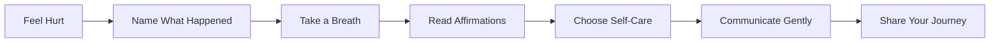

# 💛 I'm a Wife - Mindful Relationship Communication Tool

[](https://hemessedup.sm-stratagem.com/)
[](LICENSE)
[](CONTRIBUTING.md)

> A soft place to land before you press send.

**I'm a Wife** is a gentle, guided communication tool that helps women express their feelings thoughtfully in relationships. Take a breath, validate your emotions, and communicate with wisdom instead of reactive anger.

🌐 **Live App**: [hemessedup.sm-stratagem.com](https://hemessedup.sm-stratagem.com/)

## ✨ Features

### 🧘‍♀️ Guided Emotional Process
- **5-Step Journey**: From identifying what hurt you to expressing it with care
- **Breathing Exercises**: Calm your nervous system before responding
- **25 Affirmations**: Validate your feelings with supportive messages
- **12 Situations**: Identify exactly what happened
- **Custom Input**: Express your unique situation in your own words

### 💌 Communication Tools
- **Email Composition**: Craft thoughtful messages with templates
- **SMTP Integration**: Send directly via secure email
- **Link Sharing**: Include helpful resources, products, or articles
- **Auto-Send Links**: Generate shareable URLs that pre-fill forms
- **Copy-to-Clipboard**: Easily share your message anywhere

### 🎁 Self-Care Suggestions
- **Gift Selection**: Choose what would help (flowers, spa day, jewelry, etc.)
- **"I just want a gift" option**: Sometimes that's all you need to say
- **My Favourite Dessert**: Personalized comfort options
- **Automatic Links**: Product URLs included in emails

### 📱 Social Sharing
- **Story Snippets**: Share playful, randomized messages on social media
- **Platform Support**: Instagram, Facebook, Twitter, Snapchat
- **Community Building**: Inspire other women to communicate healthily
- **Shareable Links**: Create click-to-send URLs for easy sharing

### 🚀 Performance & SEO
- **10.42kb gzipped**: Lightning-fast load times
- **Code Splitting**: React vendor, icons, and main chunks
- **Brotli Compression**: 8.96kb for modern browsers
- **PWA Ready**: Install as an app on any device
- **Full SEO**: Meta tags, OG cards, Schema.org, sitemap
- **AI Optimized**: Indexed by GPTBot, Claude, Perplexity, and more

## 🎯 How It Works



1. **What Happened?** - Select from 12 specific situations or write your own
2. **Breathe** - Guided breathing with visual animation (4s in, 3s hold, 5s out)
3. **Affirmations** - Cycle through 25 validating messages
4. **A Little Something** - Pick gifts that would help (he's buying!)
5. **Tell Him Gently** - Craft and send your message with care
6. **Share Your Moment** - Inspire others on social media (optional)

## 🛠️ Tech Stack

- **Frontend**: React 18 + Vite 5
- **Icons**: Lucide React (tree-shakeable)
- **Styling**: Tailwind-inspired utility classes (inline)
- **Email**: Nodemailer + Zoho SMTP
- **Build**: Terser minification, Code splitting
- **Compression**: Gzip + Brotli
- **Analytics**: Vercel Analytics
- **Hosting**: Vercel Edge Functions

## 📦 Installation

```bash
# Clone the repository
git clone https://github.com/SM-Stratagem/ImaWife.git
cd ImaWife

# Install dependencies
npm install

# Set up environment variables
cp .env.example .env.local
# Edit .env.local with your SMTP credentials

# Start development server
npm run dev

# Or start with API server
npm start
```

## 🔧 Configuration

### SMTP Setup (`.env.local`)

```env
ZOHO_SMTP_HOST=smtp.zoho.com
ZOHO_SMTP_PORT=465
ZOHO_SMTP_USER=your-email@example.com
ZOHO_SMTP_PASSWORD=your-app-password
ZOHO_SMTP_FROM=from-email@example.com
```

### Gift Links (`ImAWifeApp.jsx`)

Update the `GIFT_OPTIONS` array with your product URLs:

```javascript
const GIFT_OPTIONS = [
  { id: "flowers", label: "Flowers", icon: Flower2, link: "https://your-flower-shop.com" },
  // ... more options
];
```

## 📱 PWA Features

- ✅ Installable on iOS, Android, Desktop
- ✅ Offline-capable (service worker)
- ✅ App-like navigation
- ✅ Custom theme colors
- ✅ Splash screens

## 🔍 SEO & Discoverability

### Search Engine Optimization
- ✅ Comprehensive meta tags (title, description, keywords)
- ✅ Open Graph protocol for social sharing
- ✅ Twitter Card integration
- ✅ Schema.org structured data (WebApplication)
- ✅ Sitemap.xml for crawler indexing
- ✅ Robots.txt with AI crawler permissions
- ✅ Canonical URLs to prevent duplicate content
- ✅ Semantic HTML5 structure

### AI Engine Optimization
- ✅ **GPTBot** - OpenAI's web crawler
- ✅ **Claude-Web** - Anthropic's crawler
- ✅ **Google-Extended** - Google's AI training
- ✅ **PerplexityBot** - Perplexity AI
- ✅ **YouBot** - You.com search
- ✅ **Amazonbot** - Amazon's crawler
- ✅ **CCBot** - Common Crawl
- ✅ Custom **ai.txt** with usage guidelines

### Additional Resources
- 📄 `/about.html` - Static SEO content page
- 🤖 `/ai.txt` - AI training guidance
- 👥 `/humans.txt` - Human-readable site info
- 🔒 `/.well-known/security.txt` - Security contact

## 🚀 Performance

### Bundle Analysis
```
Main Chunk:      35.44kb → 10.69kb gzip → 9.17kb brotli
React Vendor:   129.14kb → 41.50kb gzip → 36.30kb brotli
Icons:           12.33kb →  5.02kb gzip →  4.42kb brotli
```

### Optimization Techniques
- Code splitting by vendor and component
- Tree-shaking unused code
- Terser minification
- Console/debugger removal in production
- CSS code splitting
- Preconnect hints for external resources
- Async font loading
- Image optimization

## 🌈 Design Philosophy

> "Your feelings matter. You don't have to choose between staying silent and starting a fight. There's a third option: expressing yourself clearly, calmly, and with self-respect."

### Key Principles
1. **Validation First** - Your emotions are real and deserve to be heard
2. **Mindful Pause** - Take a breath before reacting
3. **Gentle Expression** - Communicate without escalating
4. **Self-Care Matters** - Your needs are important
5. **Community Support** - You're not alone in this

## 🤝 Contributing

We welcome contributions! Whether it's:
- 🐛 Bug reports
- 💡 Feature requests
- 📝 Documentation improvements
- 🎨 Design enhancements
- 🌍 Translations

See [CONTRIBUTING.md](CONTRIBUTING.md) for guidelines.

## 📄 License

MIT License - See [LICENSE](LICENSE) for details.

## 🙏 Acknowledgments

Made with care for the moments that don't need a fight to be heard.

Special thanks to:
- All the wives who prioritize healthy communication
- Partners who listen and grow together
- The open-source community

## 📞 Support

- 🌐 Website: [hemessedup.sm-stratagem.com](https://hemessedup.sm-stratagem.com/)
- 📧 Email: support@sm-stratagem.com
- 🐦 Twitter: [@ImAWifeApp](https://twitter.com/ImAWifeApp)
- 💬 Issues: [GitHub Issues](https://github.com/SM-Stratagem/ImaWife/issues)

## 🔮 Roadmap

- [ ] Multi-language support (Spanish, French, Portuguese)
- [ ] Therapist-approved communication templates
- [ ] Journaling feature for tracking emotions
- [ ] Couple's mode for mutual understanding
- [ ] Mobile native apps (iOS/Android)
- [ ] Integration with relationship apps
- [ ] Video guide tutorials

---

<p align="center">
  <strong>Not a substitute for therapy or professional help.</strong><br>
  This tool supports healthy communication but doesn't replace genuine relationship work.
</p>

<p align="center">
  Made with 💛 by <a href="https://sm-stratagem.com">SM Stratagem</a>
</p>
